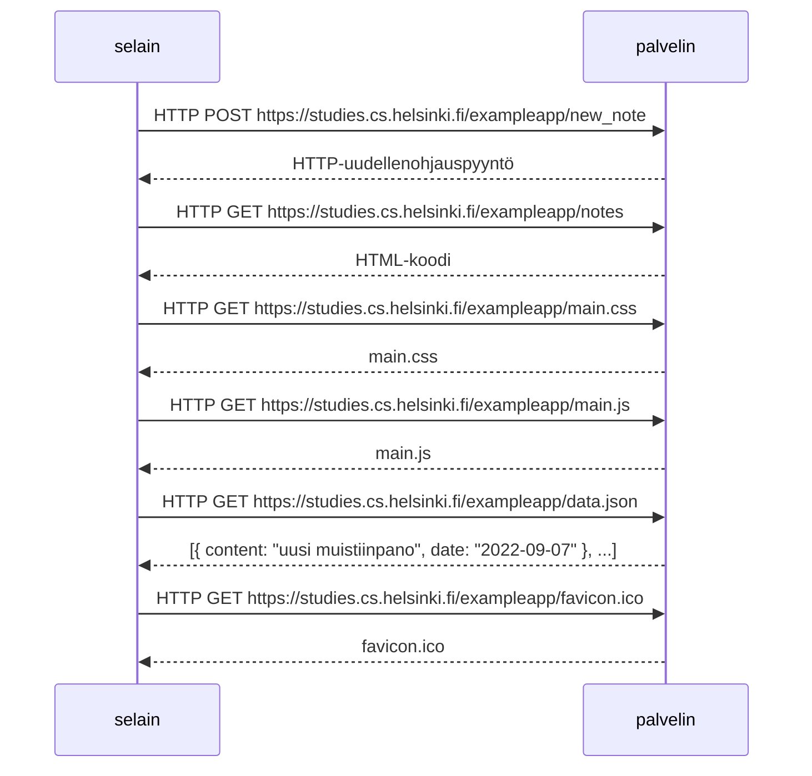

# uusi muistiinpano

```mermaid
  sequenceDiagram
  participant selain
  participant palvelin
  selain->>palvelin: HTTP POST https://studies.cs.helsinki.fi/exampleapp/new_note
  palvelin-->>selain: HTTP-uudellenohjauspyyntö
  selain->>palvelin: HTTP GET https://studies.cs.helsinki.fi/exampleapp/notes
  palvelin-->>selain: HTML-koodi
  selain->>palvelin: HTTP GET https://studies.cs.helsinki.fi/exampleapp/main.css
  palvelin-->>selain: main.css
  selain->>palvelin: HTTP GET https://studies.cs.helsinki.fi/exampleapp/main.js
  palvelin-->>selain: main.js
  selain->>palvelin: HTTP GET https://studies.cs.helsinki.fi/exampleapp/data.json
  palvelin-->>selain: [{ content: "uusi muistiinpano", date: "2022-09-07" }, ...]
  selain->>palvelin: HTTP GET https://studies.cs.helsinki.fi/exampleapp/favicon.ico
  palvelin-->>selain: favicon.ico
```
