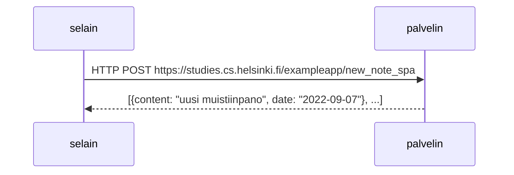

# uusi muistiinpano

```mermaid
  sequenceDiagram
  participant selain
  participant palvelin
  selain->>palvelin: HTTP POST https://studies.cs.helsinki.fi/exampleapp/new_note_spa
  palvelin-->>selain: [{content: "uusi muistiinpano", date: "2022-09-07"}, ...]
```
